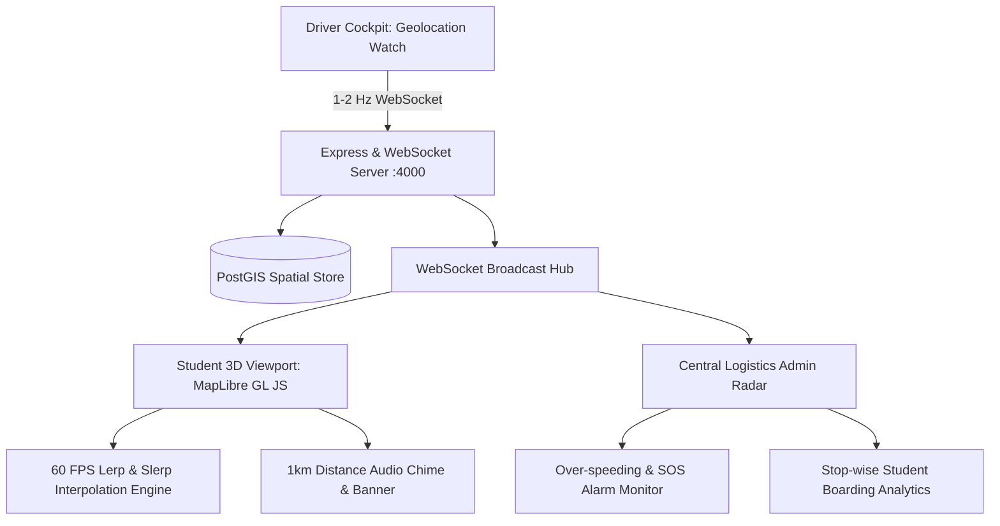

<div align="center">

  <a href="https://github.com/Rohankapoor1904/bus-Tracking-">
    
  </a>

  <p align="center">
    <b>Real-Time 3D Geospatial Transit Radar, Telemetry Streaming & Manifest System</b>
  </p>

  <p align="center">
    <a href="https://github.com/Rohankapoor1904/bus-Tracking-">
      
    </a>
    
    
    
    
  </p>

  <p align="center">
    <a href="#-institutional-identity">Campus Context</a> •
    <a href="#-quick-start-guide">Quick Start</a> •
    <a href="#-production-hardening">Production Hardening</a> •
    <a href="#-demo-personas--instant-switcher">Demo Switcher</a> •
    <a href="#-architecture--system-capabilities">Architecture</a> •
    <a href="#-repository-structure">Repository Structure</a>
  </p>

</div>

---

## 📖 Overview

**MMU FleetRadar 3D** is a production-grade real-time 3D geospatial bus tracking, high-frequency telemetry streaming, and automated student manifest management system engineered specifically for **Maharishi Markandeshwar University (MMU Mullana & Sadopur campuses)**.

The system combines high-frequency (1–2 Hz) WebSocket telemetry ingestion, smooth 60 FPS client-side lerp/slerp interpolation, photorealistic campus volumetric 3D extrusions, driver manifest check-ins, and admin safety monitors.

---

## 🏫 Institutional Identity & Grounded Data

- **Institutions:** Maharishi Markandeshwar (Deemed to be University) Mullana & MMU Sadopur Campus
- **Campus Coordinates:**
  - MMU Mullana Main Campus: `30.250450° N, 77.045050° E`
  - MMU Sadopur Ambala Campus: `30.342900° N, 76.814200° E`
- **Branding Tokens:**
  - Primary Brand Crimson: `#E21E26`
  - Academic Deep Navy: `#0D1B3E`
  - Heraldic Amber Gold: `#F59E0B` / `#FBBF24`
- **Regional Corridors Grounded:**
  1. `ROUTE-AMB-01`: Ambala Cantt Railway Station ➔ MMU Mullana Campus Terminal
  2. `ROUTE-YNR-02`: Yamunanagar Workshop Chowk ➔ Jagadhri ➔ MMU Mullana Hospital Bay
  3. `ROUTE-KKR-03`: Kurukshetra New Bus Stand ➔ Pipli ➔ Shahbad ➔ MMU Mullana Gate
  4. `ROUTE-CHD-04`: Chandigarh Tribune Chowk ➔ Sadopur Campus ➔ MMU Mullana

---

## 🚀 Quick Start Guide

### 1. Clone the Repository
```bash
git clone https://github.com/Rohankapoor1904/bus-Tracking-.git
cd bus-Tracking-
```

### 2. Start PostgreSQL (PostGIS) & Redis
```bash
# From repo root — starts PostGIS + Redis with persistent volumes:
docker compose up -d
```

### 3. Configure the Backend Environment
```bash
cp server/.env.example server/.env
# Edit server/.env — set DATABASE_URL, REDIS_URL and a strong JWT_SECRET
```
Generate a production secret with:
```bash
node -e "console.log(require('crypto').randomBytes(48).toString('hex'))"
```

### 4. Install Dependencies
```bash
npm run install:all
```

### 5. Start Backend & 3D Frontend
```bash
# Starts both Backend (Port 4000) and 3D Frontend (Port 5173):
npm run dev
```

### 6. Open in Browser
- **Frontend App:** [http://localhost:5173/](http://localhost:5173/)
- **Backend API:** [http://localhost:4000/api/v1](http://localhost:4000/api/v1)
- **Health Check:** [http://localhost:4000/health](http://localhost:4000/health)
- **WebSocket Gateway:** `ws://localhost:4000/ws`

### 7. Run Automated Test Suite
```bash
npm run test
```

### 8. Companion Mobile APK
A pre-compiled native Android package is included in the root directory: `MMU_FleetRadar_3D.apk`.

---

## 🔐 Production Hardening

- **Authentication is enforced on every mutating path.** REST endpoints use JWT + RBAC, and the WebSocket gateway rejects `TELEMETRY_PING`, `EMERGENCY_SOS` and `ATTENDANCE_UPDATE` from unauthenticated or unauthorized clients.
- **Telemetry is authenticated, role-scoped and validated.** Drivers may only broadcast for their assigned vehicle; coordinates are bounded to the MMU corridor and speed is capped before alerts/broadcasts.
- **Secrets are environment-driven.** `JWT_SECRET` has no hardcoded fallback in production, and `CORS_ORIGIN` must be an explicit allowlist.
- **Demo personas are disabled by default in production** (`ENABLE_DEMO_ACCOUNTS=false`), so shared demo passwords and `/auth/demo-accounts` are never exposed in production.
- **Transport protections:** `helmet`, request size limits, and login rate limiting.
- **Data persistence:** All fleet state lives in PostgreSQL + PostGIS, ensuring persistence across restarts; optional Redis provides latest-position caching and multi-instance WebSocket fan-out.

---

## 🔑 Demo Personas & Instant Switcher

The application includes an instant **1-Click Persona Switcher** in the navigation bar:

| Role | Name | Email | Password | Assigned Vehicle / Stop |
| :--- | :--- | :--- | :--- | :--- |
| **Student** | Aarav Gupta | `student.aarav@mmumullana.org` | `MMU@Secure2026` | BUS-01 • Ambala Cantt Stop |
| **Student** | Sneha Sharma | `student.sneha@mmumullana.org` | `MMU@Secure2026` | BUS-01 • Mahesh Nagar Stop |
| **Driver** | Rajesh Kumar Sharma | `driver.rajesh@mmumullana.org` | `MMU@Secure2026` | BUS-01 (HR-54-A-1993) |
| **Driver** | Gurpreet Singh Saini | `driver.gurpreet@mmumullana.org` | `MMU@Secure2026` | BUS-02 (HR-54-A-2004) |
| **Admin** | Dr. Sandeep Sharma | `admin@mmumullana.org` | `MMU@Secure2026` | Dean Fleet Logistics |

---

## 🎯 Architecture & System Capabilities



### 1. Student 3D Experience
- **Photorealistic 3D Buildings:** Real MMU campus blocks rendered with volumetric extrusions (`fill-extrusion`) based on actual building heights.
- **Dynamic 55° Pitch & Heading Follow:** Tilts along the vehicle's direction of travel for an authentic 3D driving perspective.
- **60 FPS Lerp & Slerp Interpolation:** GPS packets arriving at 1-2 Hz are smoothed using client-side linear and spherical shortest-arc engines.
- **1 km Geofence Push Alert:** Triggers visual notification banner and harmonic Web Audio API chime when the bus enters the 1000m perimeter of the student's stop.

### 2. Driver Transit Terminal
- **High-Contrast Cockpit:** Optimized for high-sunlight or night driving readability.
- **Continuous 1-2 Hz GPS Broadcaster:** HTML5 Geolocation watch with speed and heading calculations.
- **Screen Wake-Lock API:** Keeps the mobile device display active without timing out.
- **Offline Telemetry Queue:** Spools points locally when crossing cellular dead zones and automatically flushes on reconnect.
- **Stop-Wise Manifest Console:** Displays scheduled stops with assigned student rosters; one-tap check-in toggles (`Boarded` / `Absent`).

### 3. Central Logistics Admin Fleet Radar
- **3D Multi-Bus Canvas:** Tracks all active vehicles simultaneously with live speeds and heading vectors.
- **Stop-Wise Manifest & Capacity Analytics:** Aggregated boarding progress bars per transit corridor.
- **Real-Time Safety Alarms:** Automatic detection of over-speeding (> 75 km/h) and driver SOS calls with one-click resolution.
- **Autonomous Simulation Engine:** Built-in continuous telemetry simulator allowing immediate out-of-the-box demonstration without physical hardware.

---

## 📁 Repository Structure

```
bus-Tracking-/
├── assets/                  # Branding and vector assets
├── client/                  # Vite + React + MapLibre GL JS 3D frontend
├── server/                  # Node.js, Express, WebSocket & PostGIS telemetry engine
├── docs/                    # Technical specs & architecture documentation
├── MMU_FleetRadar_3D.apk    # Native Android companion APK
├── package.json             # Root workspace orchestrator
└── README.md                # System documentation
```

---

## 📜 License

Distributed under the MIT License.

---

<div align="center">
  <sub>Developed with ❤️ by <a href="https://github.com/Rohankapoor1904">Rohan Kapoor</a></sub>
</div>
